# Klassendiagramm & Funktionsweise — Medcode Application

> **Stand:** April 2026  
> Dieses Dokument dokumentiert die vollständige Architektur, alle Klassen/Komponenten und deren Zusammenspiel im Detail —  
> inklusive aller neueren Features wie SEO-URLs pro Krankheit, AI-Cache, Meilisearch-Hybridsuche und Sitemap-Generation.

---

## Inhaltsverzeichnis

1. [Architektur-Überblick](#1-architektur-überblick)
2. [Backend — Gesamtklassendiagramm](#2-backend--gesamtklassendiagramm)
3. [Backend — Datenmodelle (Pydantic Models)](#3-backend--datenmodelle-pydantic-models)
4. [Backend — Services (Business Logic)](#4-backend--services-business-logic)
5. [Backend — Routers (API-Endpunkte)](#5-backend--routers-api-endpunkte)
6. [Backend — Konfiguration & Dependency Injection](#6-backend--konfiguration--dependency-injection)
7. [Backend — Utility-Module](#7-backend--utility-module)
8. [Backend — Import- & Wartungs-Scripts](#8-backend--import---wartungs-scripts)
9. [Frontend — Komponentendiagramm](#9-frontend--komponentendiagramm)
10. [Frontend — Custom Hooks](#10-frontend--custom-hooks)
11. [Frontend — Utility-Module](#11-frontend--utility-module)
12. [Datenbank-Schema (ERD)](#12-datenbank-schema-erd)
13. [API-Endpunkt-Übersicht](#13-api-endpunkt-übersicht)
14. [Feature: SEO-URLs pro Krankheit](#14-feature-seo-urls-pro-krankheit)
15. [Feature: Zweiphasige Hybridsuche](#15-feature-zweiphasige-hybridsuche)
16. [Feature: AI-Cache-System](#16-feature-ai-cache-system)
17. [Feature: Sitemap & SEO](#17-feature-sitemap--seo)
18. [Feature: Kontextueller Chat](#18-feature-kontextueller-chat)

---

## 1. Architektur-Überblick

Die Medcode-Applikation ist eine **dreischichtige Webanwendung** (Frontend → Backend → Datenbank + externe Dienste), die ICD-10-Diagnosecodes durchsuchbar und verständlich macht.

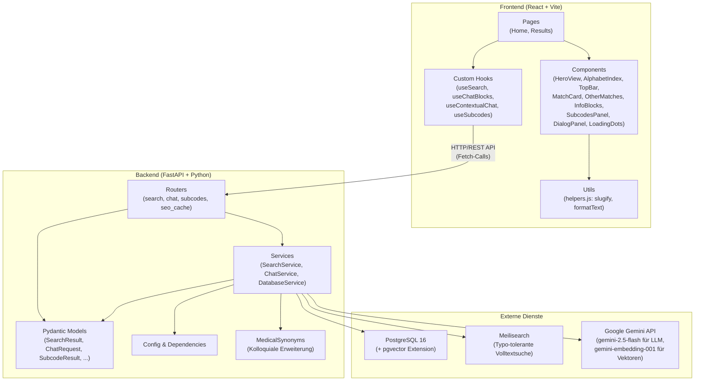

### Wie die Schichten kommunizieren

1. **Frontend → Backend:** Das React-Frontend ruft die FastAPI-Endpunkte über `fetch()`-Aufrufe auf. Die API-Base-URL wird über die Umgebungsvariable `VITE_API_BASE_URL` konfiguriert.
2. **Backend → PostgreSQL:** Der `DatabaseService` verwaltet einen Connection Pool (`psycopg2.pool.SimpleConnectionPool`) mit 1-20 Verbindungen. Alle SQL-Queries laufen über diesen Pool.
3. **Backend → Meilisearch:** Der `SearchService` nutzt den Meilisearch-Python-Client für schnelle, typo-tolerante Suchen. Meilisearch läuft als eigener Docker-Container.
4. **Backend → Gemini API:** Sowohl der `ChatService` (für LLM-Antworten via `gemini-2.5-flash`) als auch der `SearchService` (für Embeddings via `gemini-embedding-001`) kommunizieren über den Google `genai`-Client.

---

## 2. Backend — Gesamtklassendiagramm

```mermaid
classDiagram
    direction TB

    %% ═══════════════════════════════════════════════════
    %% Pydantic Models (Datenmodelle)
    %% ═══════════════════════════════════════════════════

    class SearchResult {
        <<Pydantic BaseModel>>
        +str code
        +str title
        +float score = 0.0
        +str version = "2024"
    }

    class SearchResponse {
        <<Pydantic BaseModel>>
        +List~SearchResult~ results
    }

    class ChatRequest {
        <<Pydantic BaseModel>>
        +str question
    }

    class ContextualChatRequest {
        <<Pydantic BaseModel>>
        +str question
        +str condition_code
        +str condition_title
    }

    class ChatResponse {
        <<Pydantic BaseModel>>
        +str answer
        +bool disclaimer = False
    }

    class SubcodeResult {
        <<Pydantic BaseModel>>
        +str code
        +str title
        +int synonym_count = 0
        +Optional~bool~ is_leaf = None
    }

    class SubcodeResponse {
        <<Pydantic BaseModel>>
        +str parent_code
        +str parent_title
        +List~SubcodeResult~ subcodes
    }

    SearchResponse o-- SearchResult : "results[]"
    SubcodeResponse o-- SubcodeResult : "subcodes[]"

    %% ═══════════════════════════════════════════════════
    %% Services (Business Logic Layer)
    %% ═══════════════════════════════════════════════════

    class DatabaseService {
        <<Service Singleton>>
        -pool : SimpleConnectionPool
        -_ensure_pool() void
        +close() void
        +get_connection() ContextManager~Connection~
        +get_subcodes_from_db(code: str) tuple
        +get_cached_chat(code: str, prompt_type: str) str
        +save_cached_chat(code: str, prompt_type: str, ans: str) void
        +get_cached_conditions_from_db() list
        +get_sitemap_codes() list
        +run_vector_search_query(embedding: list, limit: int) list
        +get_icd_code_direct(code: str) tuple|None
    }

    class ChatService {
        <<Service Singleton>>
        -db_service : DatabaseService
        -genai_client : genai.Client
        +__init__(db_service, genai_client)
        +ask_gemini(prompt: str) str
        +handle_cached_chat(req, prompt_type, prompt_template, disclaimer) ChatResponse
    }

    class SearchService {
        <<Service Singleton>>
        -db : DatabaseService
        -chat_service : ChatService
        -genai_client : genai.Client
        -meili_index : meilisearch.Index
        +__init__(db_service, chat_service, genai_client, meili_index)
        -_get_gemini_embedding(text: str) list~float~
        -_run_vector_search(q_text: str, limit: int) list~SearchResult~
        +perform_search(q: str, limit: int) SearchResponse
        +perform_refined_search(q: str, limit: int) SearchResponse
    }

    ChatService --> DatabaseService : "db_service"
    SearchService --> DatabaseService : "db"
    SearchService --> ChatService : "chat_service"
    SearchService ..> SearchResult : "erzeugt"
    SearchService ..> SearchResponse : "erzeugt"
    ChatService ..> ChatResponse : "erzeugt"

    %% ═══════════════════════════════════════════════════
    %% Routers (API Layer)
    %% ═══════════════════════════════════════════════════

    class SearchRouter {
        <<FastAPI Router>>
        +GET /api/search(q, limit) SearchResponse
        +GET /api/search/refined(q, limit) SearchResponse
    }

    class ChatRouter {
        <<FastAPI Router>>
        +POST /api/chat/explain(ChatRequest) ChatResponse
        +POST /api/chat/specialist(ChatRequest) ChatResponse
        +POST /api/chat/guidance(ChatRequest) ChatResponse
        +POST /api/chat/contextual(ContextualChatRequest) ChatResponse
    }

    class SubcodesRouter {
        <<FastAPI Router>>
        +GET /api/subcodes(code) SubcodeResponse
    }

    class SeoCacheRouter {
        <<FastAPI Router>>
        +GET /api/cached-conditions() dict
        +GET /sitemap.xml() Response
    }

    SearchRouter --> SearchService : "Depends()"
    ChatRouter --> ChatService : "Depends()"
    SubcodesRouter --> DatabaseService : "Depends()"
    SeoCacheRouter --> DatabaseService : "Depends()"

    SearchRouter ..> SearchResponse : "returns"
    ChatRouter ..> ChatRequest : "receives"
    ChatRouter ..> ContextualChatRequest : "receives"
    ChatRouter ..> ChatResponse : "returns"
    SubcodesRouter ..> SubcodeResponse : "returns"

    %% ═══════════════════════════════════════════════════
    %% FastAPI Application & Config
    %% ═══════════════════════════════════════════════════

    class FastAPIApp {
        <<FastAPI>>
        +title = "Medcode API"
        +lifespan(app)
        +CORSMiddleware
        +GET /() dict
    }

    class Config {
        <<Module: config.py>>
        +str DB_HOST
        +str DB_NAME
        +str DB_USER
        +str DB_PASSWORD
        +str GEMINI_API_KEY
        +str MEILI_URL
        +str MEILI_KEY
        +genai.Client genai_client
        +meilisearch.Index meili_index
    }

    class Dependencies {
        <<Module: dependencies.py>>
        +DatabaseService db_service
        +ChatService chat_service
        +SearchService search_service
        +get_db_service() DatabaseService
        +get_chat_service() ChatService
        +get_search_service() SearchService
    }

    class MedicalSynonyms {
        <<Module: medical_synonyms.py>>
        +dict COLLOQUIAL_EXPANSION
        +expand_query(q: str) str
    }

    FastAPIApp --> SearchRouter : "include_router"
    FastAPIApp --> ChatRouter : "include_router"
    FastAPIApp --> SubcodesRouter : "include_router"
    FastAPIApp --> SeoCacheRouter : "include_router"
    Dependencies --> Config : "importiert Clients"
    Dependencies --> DatabaseService : "erzeugt Singleton"
    Dependencies --> ChatService : "erzeugt Singleton"
    Dependencies --> SearchService : "erzeugt Singleton"
    SearchService --> MedicalSynonyms : "expand_query()"
```

---

## 3. Backend — Datenmodelle (Pydantic Models)

Die Pydantic Models definieren das Schema aller API-Requests und -Responses. FastAPI nutzt sie automatisch zur **Validierung**, **Serialisierung** und **OpenAPI-Dokumentation**.

**Datei:** `src/backend/models/`

### Wie sie funktionieren

| Model                  | Zweck                                                                    | Verwendet von                               |
|------------------------|--------------------------------------------------------------------------|---------------------------------------------|
| `SearchResult` | Ein einzelner ICD-10-Treffer mit Code, Titel, Score und Version | SearchRouter → Frontend |
| `SearchResponse` | Wrapper um eine Liste von `SearchResult`-Objekten | SearchRouter |
| `ChatRequest` | Einfache Frage vom User (z.B. `"I10: Essentielle Hypertonie"`) | ChatRouter (explain, specialist, guidance) |
| `ContextualChatRequest` | Erweiterte Frage im Kontext einer bestimmten Diagnose | ChatRouter (contextual) |
| `ChatResponse` | KI-Antwort mit optionalem Disclaimer-Flag | ChatRouter → Frontend |
| `SubcodeResult` | Ein einzelner Subcode mit Code, Titel, Synonym-Anzahl und Blatt-Flag | SubcodesRouter → Frontend |
| `SubcodeResponse` | Parent-Code + Titel mit Liste aller Subcodes | SubcodesRouter |

### Vererbungsbeziehungen

Alle Models erben von `pydantic.BaseModel`. Es gibt **keine** Vererbung untereinander — jedes Model ist eigenständig. Die Komposition geschieht über `List[...]`-Felder:

- `SearchResponse.results` → `List[SearchResult]`
- `SubcodeResponse.subcodes` → `List[SubcodeResult]`

---

## 4. Backend — Services (Business Logic)

Die Service-Schicht enthält die gesamte Geschäftslogik. **Kein FastAPI-Code** (Routing, Dependency Injection) befindet sich hier — das ist bewusste Trennung.

**Datei:** `src/backend/services/`

### 4.1 DatabaseService (`db_service.py`)

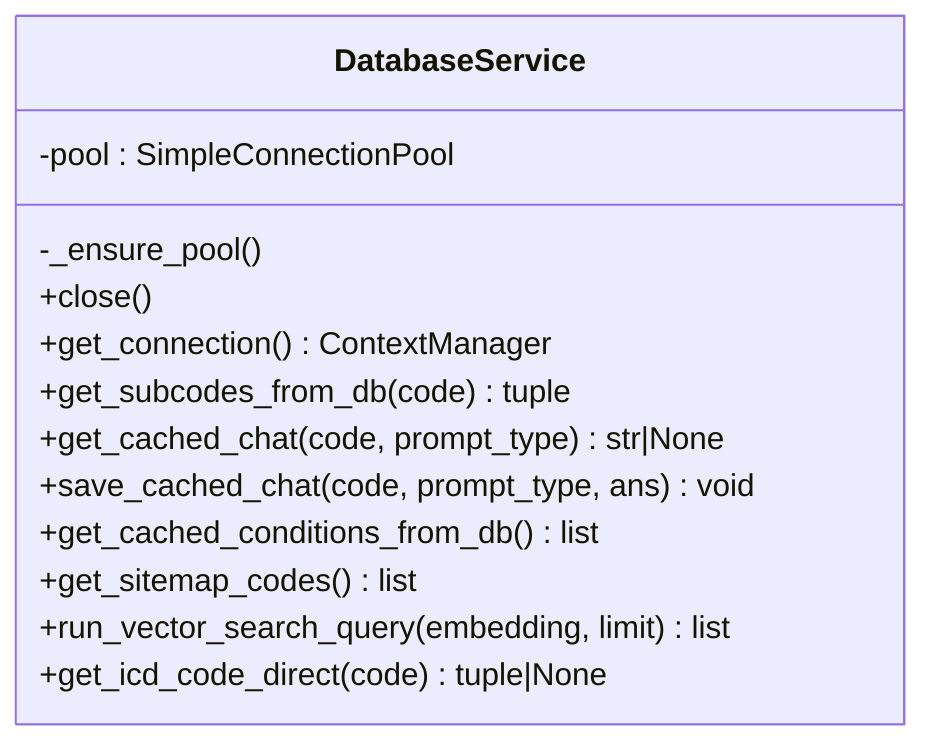

**Funktionsweise:**

- **Lazy Pool-Initialisierung:** Der Connection Pool wird erst beim ersten Datenbankzugriff erstellt (`_ensure_pool()`). Das verhindert Fehler durch Docker Startup Race Conditions (DB-Container noch nicht bereit, wenn Backend startet).
- **Context Manager:** `get_connection()` ist ein `@contextmanager`, der automatisch Verbindungen aus dem Pool holt und nach Verwendung zurückgibt — kein manuelles Connection-Management nötig.
- **`get_subcodes_from_db(code)`:** Holt den Parent-Titel und alle 4+-stelligen Subcodes eines 3-stelligen ICD-Codes. Subcodes werden nach Synonym-Anzahl sortiert (Proxy für klinische Relevanz).
- **`get_cached_chat(code, prompt_type)`:** Prüft, ob für einen ICD-Code und Prompt-Typ (explain/specialist/guidance) bereits eine gecachte KI-Antwort existiert.
- **`save_cached_chat(code, prompt_type, ans)`:** Speichert neue KI-Antworten in den Cache. Fehlerhafte Antworten (z.B. "Error...") werden **nicht** gecacht.
- **`run_vector_search_query(embedding, limit)`:** Führt eine pgvector Cosine-Similarity-Suche durch. Die Query aggregiert Subcodes zu 3-stelligen Kategorien und berechnet einen kombinierten Score (`0.6 × MAX + 0.4 × AVG`).
- **`get_icd_code_direct(code)`:** Exakter Lookup eines 3-stelligen ICD-Codes.
- **`get_cached_conditions_from_db()` / `get_sitemap_codes()`:** Holen alle ICD-Codes, die im AI-Cache existieren — für die Landing Page (A-Z-Index) und Sitemap-Generierung.

### 4.2 ChatService (`chat_service.py`)

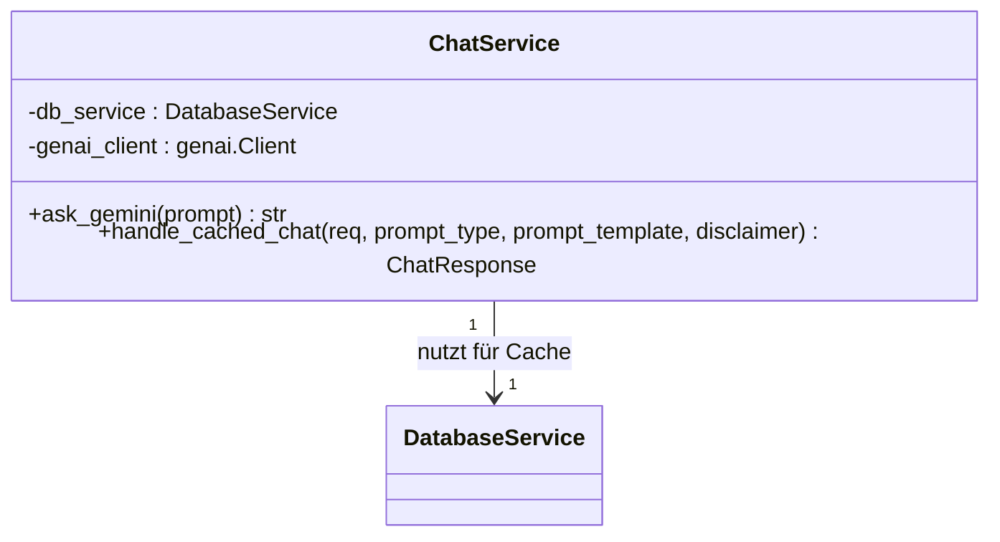

**Funktionsweise:**

- **`ask_gemini(prompt)`:** Sendet einen Prompt an das Google Gemini LLM (`gemini-2.5-flash`). Gibt die Textantwort zurück oder einen Fehlerstring bei Problemen.
- **`handle_cached_chat(req, prompt_type, prompt_template, disclaimer)`:**
  1. Extrahiert den ICD-Code aus der Frage (z.B. `"I10: Essentielle..."` → `"I10"`)
  2. Prüft, ob eine gecachte Antwort existiert (via `db_service.get_cached_chat`)
  3. **Cache Hit:** Gibt die gecachte Antwort sofort zurück (keine API-Kosten, keine Latenz)
  4. **Cache Miss:** Ruft Gemini auf, speichert die Antwort im Cache, gibt sie zurück
  
  Dieses Cache-Muster ist extrem wichtig, da die Gemini API **Rate Limits** hat (Free Tier: 15 Requests/Minute) und Antworten für denselben ICD-Code immer gleich sind.

### 4.3 SearchService (`search_service.py`)

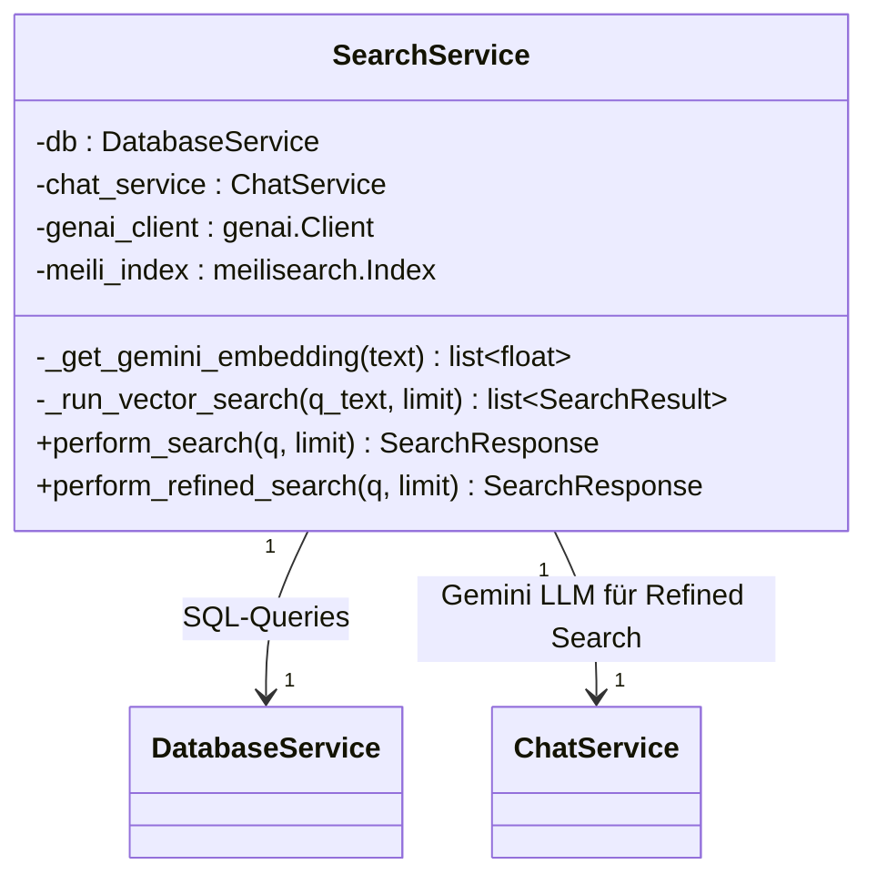

**Funktionsweise von `perform_search()` — Die dreistufige Hybridsuche:**

```text
Benutzer-Eingabe
   │
   ▼
┌──────────────────────────────────────────────┐
│ Stufe 1: Direkter ICD-Code-Match             │
│ Regex: /^[A-Z]\d{2}(\.d+)?$/                │
│ z.B. "R51" → direkter DB-Lookup             │
│ Score: 1.0 (perfekter Treffer)               │
│ Falls Match → sofort zurückgeben             │
└──────────────────────────────────────────────┘
   │ kein Match
   ▼
┌──────────────────────────────────────────────┐
│ Stufe 2: Meilisearch (PRIMARY)               │
│ • Typo-tolerant (4/6 statt default 5/8)      │
│ • Synonym-aware (DE Kolloquialsprache)       │
│ • Subcode-Penalty: ×0.85 für 4+-stellige     │
│ • Deduplizierung auf 3-Steller               │
│ • Threshold: Score >= 0.75                   │
│ Falls starke Treffer → zurückgeben           │
└──────────────────────────────────────────────┘
   │ kein starker Treffer / Meilisearch down
   ▼
┌──────────────────────────────────────────────┐
│ Stufe 3: pgvector Fallback                   │
│ • Query wird mit MedicalSynonyms expandiert  │
│ • Embedding via Gemini API generiert         │
│ • Cosine-Similarity-Suche in PostgreSQL      │
│ • Threshold: raw_sim >= 0.73                 │
└──────────────────────────────────────────────┘
```

**Funktionsweise von `perform_refined_search()` — Gemini-erweiterte Suche:**

Diese wird vom Frontend **parallel** zum normalen Search aufgerufen, wenn der Confidence-Score des Top-Ergebnisses < 0.75 ist:

1. Gemini wird gebeten, aus der natürlichen Sprache **5 medizinische Fachbegriffe** zu extrahieren
2. Jeder dieser Begriffe wird einzeln in Meilisearch gesucht
3. Die besten Treffer werden zusammengeführt und dedupliziert
4. Falls Meilisearch keine starken Ergebnisse liefert: pgvector-Fallback mit der expandierten Query

---

## 5. Backend — Routers (API-Endpunkte)

Die Router definieren die HTTP-Endpunkte und delegieren **alle Logik an die Services**. Sie enthalten selbst keine Geschäftslogik.

**Datei:** `src/backend/routers/`

### 5.1 SearchRouter (`routers/search.py`)

| Endpunkt               | Methode | Parameter                              | Funktion                                                      |
|------------------------|---------|----------------------------------------|---------------------------------------------------------------|
| `/api/search`          | GET     | `q` (string), `limit` (int, default 5) | Dreistufige Hybridsuche (Code → Meili → pgvector)             |
| `/api/search/refined`  | GET     | `q` (string), `limit` (int, default 5) | Gemini-erweiterte Suche für komplexere Symptom-Beschreibungen |

**Wie es funktioniert:** Beide Endpunkte empfangen die Suchanfrage als Query-Parameter, holen sich den `SearchService` via FastAPI Dependency Injection (`Depends(get_search_service)`) und rufen die entsprechende Service-Methode auf. Das SearchService-Objekt ist ein **Singleton** — alle Requests teilen sich dieselbe Instanz.

### 5.2 ChatRouter (`routers/chat.py`)

| Endpunkt               | Methode | Request-Body            | Funktion                                  |
|------------------------|---------|-------------------------|-------------------------------------------|
| `/api/chat/explain`    | POST    | `ChatRequest`           | Laienverständliche Erklärung der Diagnose |
| `/api/chat/specialist` | POST    | `ChatRequest`           | Welcher Facharzt ist zuständig?           |
| `/api/chat/guidance`   | POST    | `ChatRequest`           | Gängige Behandlungsmethoden               |
| `/api/chat/contextual` | POST    | `ContextualChatRequest` | Folgefrage im Kontext einer Diagnose      |

**Wie es funktioniert:** Die drei Info-Block-Endpunkte (`explain`, `specialist`, `guidance`) nutzen **denselben Caching-Mechanismus**: Sie definieren jeweils einen deutschen Prompt-Template und rufen `chat_service.handle_cached_chat()` auf. Der `contextual`-Endpunkt hingegen fragt Gemini **immer frisch** (ohne Cache), da Folgefragen individuell sind.

### 5.3 SubcodesRouter (`routers/subcodes.py`)

| Endpunkt        | Methode | Parameter        | Funktion                                              |
|-----------------|---------|------------------|-------------------------------------------------------|
| `/api/subcodes` | GET     | `code` (string)  | Alle 4-stelligen Subcodes eines 3-stelligen ICD-Codes |

**Wie es funktioniert:** Normalisiert den Code (`strip().upper()[:3]`), fragt den `DatabaseService` nach Parent-Title + Subcodes und baut daraus ein `SubcodeResponse`-Objekt zusammen. Subcodes sind nach Synonym-Anzahl sortiert (höchste klinische Relevanz zuerst).

### 5.4 SeoCacheRouter (`routers/seo_cache.py`)

| Endpunkt                 | Methode | Funktion                                                   |
|--------------------------|---------|------------------------------------------------------------|
| `/api/cached-conditions` | GET     | Alle ICD-Codes mit gecachter KI-Erklärung (für A-Z-Index)  |
| `/sitemap.xml`           | GET     | Dynamische XML-Sitemap aller gecachten Krankheitsseiten    |

**Wie es funktioniert:**

- **`/api/cached-conditions`:** JOINed `icd_class` mit `icd_ai_cache` — nur Krankheiten, für die bereits KI-Antworten gecacht wurden, erscheinen im A-Z-Index auf der Landing Page.
- **`/sitemap.xml`:** Generiert eine vollständige XML-Sitemap mit allen gecachten Krankheitsseiten. Jede URL folgt dem Schema `https://medcode.ch/{slug}/{code}` (z.B. `https://medcode.ch/akuter-myokardinfarkt/I21`). Die `slugify()`-Logik im Backend spiegelt exakt die Frontend-Implementierung.

---

## 6. Backend — Konfiguration & Dependency Injection

### `config.py` — Zentrale Konfiguration

Alle Umgebungsvariablen werden **ausschliesslich** in `config.py` geladen. Kein anderes Modul im produktiven Code ruft `os.getenv()` direkt auf. Die Datei:

1. Lädt die `.env`-Datei via `dotenv`
2. Exponiert DB-Credentials als Konstanten (`DB_HOST`, `DB_NAME`, etc.)
3. Initialisiert den **Gemini-Client** (`genai.Client`) — nur wenn `GEMINI_API_KEY` gesetzt ist
4. Initialisiert den **Meilisearch-Client** und den Index `icd10` — mit Fallback auf `None` falls Meili nicht erreichbar

### `dependencies.py` — Singleton-Wiring

Erstellt die drei Service-Singletons und verdrahtet ihre Abhängigkeiten:

```text
Config (genai_client, meili_index)
   │
   ▼
DatabaseService()  ← keine Abhängigkeiten
   │
   ▼
ChatService(db_service, genai_client)
   │
   ▼
SearchService(db_service, chat_service, genai_client, meili_index)
```

Die Funktionen `get_db_service()`, `get_chat_service()`, `get_search_service()` werden als FastAPI-`Depends()`-Provider in den Routern verwendet.

---

## 7. Backend — Utility-Module

### `medical_synonyms.py` — Kolloquiale Query-Erweiterung

**Zweck:** Wenn ein Benutzer umgangssprachliche Begriffe eingibt (z.B. "Bluthochdruck"), erweitert dieses Modul die Query mit medizinischen Fachbegriffen ("Hypertonie", "arterielle Hypertonie", "Hochdruck").

**Wie es funktioniert:**

- Ein **Dictionary** `COLLOQUIAL_EXPANSION` mappt ~70 deutsche Alltagsbegriffe auf Listen medizinischer Fachterminologie
- Die Funktion `expand_query(q)` prüft, ob der Suchbegriff (lowercased) als Substring in einem der Keys vorkommt
- Bei Treffer werden die Fachbegriffe an die Query angehängt: `"Bluthochdruck"` → `"Bluthochdruck Hypertonie arterielle Hypertonie Hochdruck"`
- Diese erweiterte Query wird dann für den pgvector-Embedding-Search verwendet, was die Treffergenauigkeit deutlich verbessert

---

## 8. Backend — Import- & Wartungs-Scripts

### `import_icd.py` — Initialer Datenimport

**Wann:** Einmalig beim Erstsetup oder nach ICD-Katalog-Updates.

**Was es tut:**

1. **Erstellt Datenbank-Tabellen** (`icd_class`, `icd_synonym`, `icd_embedding`) + aktiviert pgvector
2. **Importiert XML** (offizielle ICD-10-GM ClaML-Datei): Parst ~15.000 Klassifikationseinträge mit Codes, Titeln, Definitionen und Metadaten
3. **Generiert Embeddings für Titel:** Batchweise (500er-Batches) werden Titel-Embeddings via Gemini API erzeugt und in `icd_embedding` gespeichert
4. **Importiert TXT** (alphabetisches Verzeichnis): Parst ~80.000 Synonym-Einträge, speichert sie in `icd_synonym` und generiert jeweils Embeddings

### `import_meili.py` — Meilisearch-Index-Aufbau

**Wann:** Nach dem ICD-Import oder bei Änderungen an der Suchkonfiguration.

**Was es tut:**

1. Holt alle 3-stelligen ICD-Codes aus PostgreSQL
2. Holt **nur** Synonyme, die direkt auf 3-stelligen Codes liegen (keine Subcode-Synonyme — bewusste Design-Entscheidung gegen Falsch-Boosts)
3. Baut für jeden Code ein Meilisearch-Dokument mit `search_text` (Code + Titel + Synonyme)
4. Konfiguriert **Typo-Toleranz** (`oneTypo: 4`, `twoTypos: 6` statt Standard 5/8) für bessere Erkennung stark falsch geschriebener Wörter
5. Lädt **Synonym-Mappings** für deutsche Umgangssprache (z.B. "herzinfarkt" ↔ "myokardinfarkt")

### `seed_cache.py` — AI-Cache-Vorwärmer

**Wann:** Einmalig nach Deployment, um die häufigsten Krankheiten vorab zu cachen.

**Was es tut:**

1. Holt die 100 meistverbreiteten ICD-Codes (nach Synonym-Anzahl sortiert)
2. Ruft für jeden Code die drei Chat-Endpunkte (`/chat/explain`, `/chat/specialist`, `/chat/guidance`) auf
3. Wartet 4,2 Sekunden zwischen Requests (Google Free Tier: 15 RPM)
4. Die Antworten werden dadurch intern gecacht — nachfolgende Benutzer erhalten instant Antworten

---

## 9. Frontend — Komponentendiagramm

```mermaid
classDiagram
    direction TB

    class App {
        <<Root Component>>
        Routes: / → Home
        Routes: /search → Results
        Routes: /:slug/:code → Results
    }

    class Home {
        <<Page Component>>
        -searchTerm : string
        -activeLetter : string
        -cachedConditions : array
        +handleSearch(term) void
        +handleSelectCondition(code, title) void
        Fetches: GET /api/cached-conditions
    }

    class Results {
        <<Page Component>>
        -searchTerm : string
        +useSearch() hook
        +useChatBlocks() hook
        +useContextualChat() hook
        +useSubcodes() hook
        +handleSearch(term) void
        +handleSelectCondition(code, title, score) void
        +handleReset() void
        Sets: document.title dynamisch
    }

    class HeroView {
        <<Presentational>>
        Zeigt: Suchfeld + A-Z-Index
    }

    class AlphabetIndex {
        <<Presentational>>
        Zeigt: Buchstaben-Navigation + Krankheitsliste
        Erzeugt: SEO-freundliche href-Links
    }

    class TopBar {
        <<Presentational>>
        Zeigt: Logo + Suchfeld (kompakt)
    }

    class MatchCard {
        <<Presentational>>
        Zeigt: ICD-Code, Titel, Konfidenz-Tacho
        Zeigt: KI-verfeinert Badge
        Zeigt: Loading-Animation
    }

    class OtherMatches {
        <<Presentational>>
        Zeigt: Alternative Treffer als Chips
        Zeigt: Tooltip mit Titel + Score
    }

    class InfoBlocks {
        <<Presentational>>
        Zeigt: 3 KI-Karten (Was?, Wer?, Wie?)
        Zeigt: extradoc.ch Link
    }

    class SubcodesPanel {
        <<Presentational>>
        Zeigt: Aufklappbare Subcode-Liste
        Zeigt: Relevanz-Balken pro Subcode
    }

    class DialogPanel {
        <<Presentational>>
        Zeigt: Kontextuelles Chat-Interface
        Zeigt: User/Assistant Nachrichten-Bubbles
    }

    class LoadingDots {
        <<UI Atom>>
        Zeigt: Animierte "..."
    }

    App --> Home : "Route /"
    App --> Results : "Route /search, /:slug/:code"
    Home --> HeroView : renders
    HeroView --> AlphabetIndex : renders
    Results --> TopBar : renders
    Results --> MatchCard : renders
    Results --> OtherMatches : renders
    Results --> InfoBlocks : renders
    Results --> SubcodesPanel : renders
    Results --> DialogPanel : renders
    MatchCard --> LoadingDots : renders
```

### Wie die Komponenten zusammenspielen

1. **`App.jsx`** definiert drei Routen:
   - `/` → Landing Page (`Home`)
   - `/search?q=...` → Suchergebnis-Seite (`Results`)
   - `/:slug/:code` → **SEO-URL** für eine bestimmte Krankheit (z.B. `/akuter-myokardinfarkt/I21`)

2. **`Home.jsx`** rendert die Landing Page:
   - Beim Laden werden gecachte Krankheiten via `/api/cached-conditions` geholt
   - Suchformular: Bei Enter/Click navigiert die App zu `/search?q={term}`
   - A-Z-Index: Klick auf eine gecachte Krankheit navigiert direkt zu `/{slug}/{code}`

3. **`Results.jsx`** ist die Hauptseite — sie orchestriert **4 Hooks** und **6 Subkomponenten**:
   - Beim Laden liest sie entweder `code` aus der URL (`:slug/:code`) oder `q` aus den Query-Params (`/search?q=...`)
   - Führt die Suche aus, holt KI-Blöcke und Subcodes
   - **SEO-Redirect:** Wenn der User über `/search?q=diabetes` kam, wird nach der Suche die URL automatisch zu `/diabetes-mellitus-typ-2/E11` umgeschrieben (via `navigate(..., { replace: true })`)
   - Setzt `document.title` dynamisch für SEO

---

## 10. Frontend — Custom Hooks

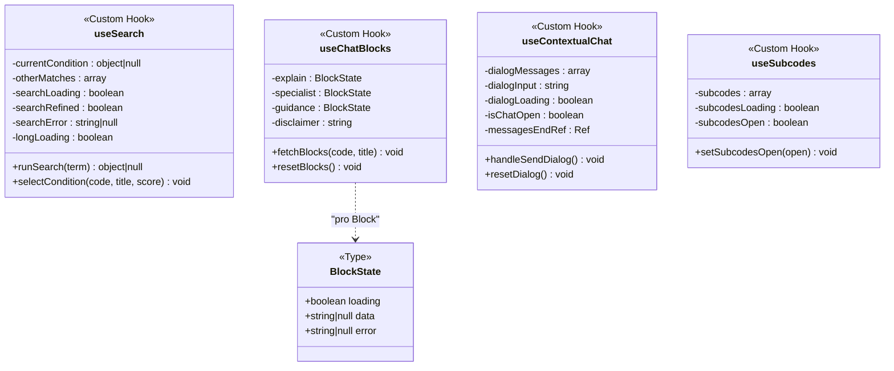

### 10.1 `useSearch` — Zweiphasen-Suchlogik

**Konstante:** `REFINE_THRESHOLD = 0.75`

**Ablauf von `runSearch(term)`:**

```text
1. Reset aller States (loading=true, error=null, results=[])
2. GET /api/search?q={term}&limit=5
3. Keine Ergebnisse? → searchError setzen, return null
4. Top-Score >= 0.75?
   → JA: Sofort anzeigen (currentCondition = top, otherMatches = rest)
   → NEIN: Weiter zu Phase 2
5. GET /api/search/refined?q={term}&limit=5
6. Refined hat Ergebnisse?
   → JA: searchRefined=true, Ergebnisse anzeigen
   → NEIN: Fallback auf originale (schwache) Ergebnisse
```

**`longLoading`-Timer:** Nach 2,5 Sekunden wird `longLoading=true` gesetzt. Das Frontend zeigt dann einen Hinweis „Detaillierte Analyse deines komplexeren Symptoms..." — das signalisiert dem User, dass gerade die Gemini-Refined-Suche läuft.

**`selectCondition(code, title, score)`:** Tauscht den Primary-Match mit einem der alternativen Treffer. Der bisherige Primary wird in die `otherMatches`-Liste verschoben.

### 10.2 `useChatBlocks` — Drei parallele KI-Blöcke

**Ablauf von `fetchBlocks(code, title)`:**

```text
1. Question zusammenbauen: "{code}: {title}"
2. Alle drei States auf loading=true setzen
3. PARALLEL drei POST-Requests feuern:
   - POST /api/chat/explain   → setExplain
   - POST /api/chat/specialist → setSpecialist  
   - POST /api/chat/guidance   → setGuidance
4. Bei explain-Response mit disclaimer=true:
   → Disclaimer-Text mit extradoc.ch-Link setzen
```

Die drei Blöcke laden **unabhängig voneinander** — jeder hat seinen eigenen `{loading, data, error}`-State. Dadurch erscheint jeder Block sofort, sobald sein API-Call fertig ist.

### 10.3 `useContextualChat` — Folgefragen-Dialog

**Ablauf von `handleSendDialog()`:**

```text
1. User-Nachricht sofort in dialogMessages anhängen (optimistic UI)
2. POST /api/chat/contextual mit:
   - question: User-Eingabe
   - condition_code: aktueller ICD-Code
   - condition_title: aktuelle Diagnose
3. Antwort als "assistant"-Nachricht anhängen
4. Auto-Scroll zum neuesten Eintrag (via messagesEndRef)
```

**Wichtig:** Der kontextuelle Chat wird **nicht gecacht** (im Gegensatz zu den Info-Blöcken), da jede Folgefrage individuell ist.

### 10.4 `useSubcodes` — Subcode-Panel

**Funktionsweise:**

- Reagiert auf Änderungen von `currentCondition?.code` via `useEffect`
- Extrahiert die ersten 3 Zeichen als Parent-Code
- `GET /api/subcodes?code={code3}`
- Setzt die Subcodes-Liste und den Open/Closed-State

---

## 11. Frontend — Utility-Module

### `helpers.js`

**`slugify(text)`** — Konvertiert deutschen Text in URL-sichere Slugs:

```text
Eingabe: "Akuter Myokardinfarkt"
Ausgabe: "akuter-myokardinfarkt"

Eingabe: "Schilddrüsenüberfunktion"
Ausgabe: "schilddruesenueberfunktion"

Eingabe: "" oder null
Ausgabe: "diagnose"
```

Regeln:

1. Alles lowercase
2. Umlaute transliterieren: ö→oe, ä→ae, ü→ue, ß→ss
3. Alles Nicht-Alphanumerische durch Bindestriche ersetzen
4. Führende/nachfolgende Bindestriche entfernen

> **Wichtig:** Die `slugify()`-Funktion im Frontend und die `slugify()`-Funktion im Backend (`routers/seo_cache.py`) müssen **identisch** arbeiten, damit die Sitemap-URLs mit den Frontend-Routen übereinstimmen!

**`formatText(text)`** — Konvertiert Gemini-Klartext in HTML:

- Doppelte Newlines → `<p>`-Tags
- Einfache Newlines → `<br>`
- `**fett**` → `<strong>fett</strong>`
- Gibt ein `{ __html: "..." }` Objekt zurück für Reacts `dangerouslySetInnerHTML`

---

## 12. Datenbank-Schema (ERD)

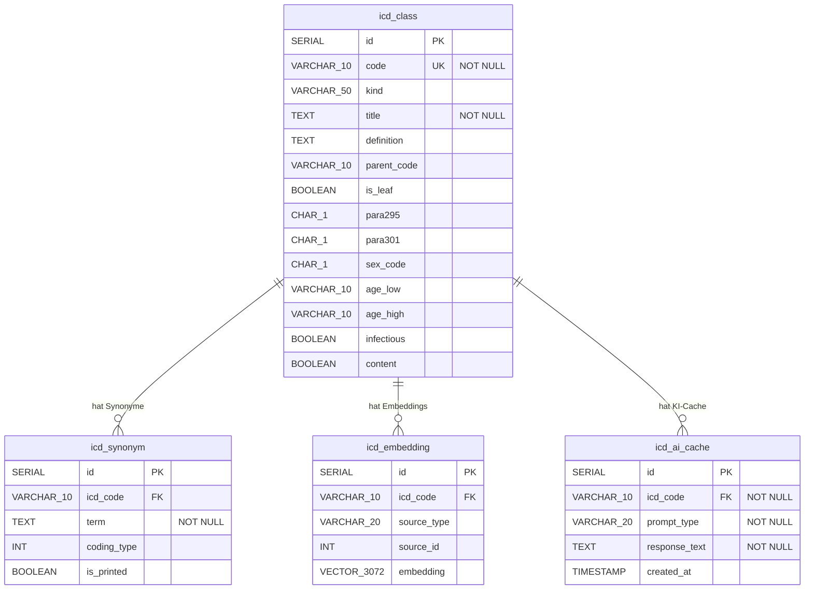

### Tabellen im Detail

| Tabelle         | Zweck                                                                    | Einträge (ca.)     |
|-----------------|--------------------------------------------------------------------------|--------------------|
| `icd_class` | Offizielle ICD-10-GM Klassifikation mit allen Metadaten | ~15.000 |
| `icd_synonym` | Alphabetisches Verzeichnis — alternative Bezeichnungen für jeden Code | ~80.000 |
| `icd_embedding` | 3072-dimensionale Vektoren für semantische Suche (pgvector) | ~95.000 |
| `icd_ai_cache` | Gecachte Gemini-Antworten (explain, specialist, guidance) pro ICD-Code | ~300 (Top-100 × 3) |

---

## 13. API-Endpunkt-Übersicht

| Methode | Endpunkt                 | Router         | Service         | Request                 | Response              |
|---------|--------------------------|----------------|-----------------|-------------------------|-----------------------|
| `GET` | `/` | main.py | – | – | `{"status": "ok"}` |
| `GET` | `/api/search` | SearchRouter | SearchService | `q`, `limit` (Query) | `SearchResponse` |
| `GET` | `/api/search/refined` | SearchRouter | SearchService | `q`, `limit` (Query) | `SearchResponse` |
| `POST` | `/api/chat/explain` | ChatRouter | ChatService | `ChatRequest` | `ChatResponse` |
| `POST` | `/api/chat/specialist` | ChatRouter | ChatService | `ChatRequest` | `ChatResponse` |
| `POST` | `/api/chat/guidance` | ChatRouter | ChatService | `ChatRequest` | `ChatResponse` |
| `POST` | `/api/chat/contextual` | ChatRouter | ChatService | `ContextualChatRequest` | `ChatResponse` |
| `GET` | `/api/subcodes` | SubcodesRouter | DatabaseService | `code` (Query) | `SubcodeResponse` |
| `GET` | `/api/cached-conditions` | SeoCacheRouter | DatabaseService | – | `{"conditions": [...]}` |
| `GET` | `/sitemap.xml` | SeoCacheRouter | DatabaseService | – | XML |

---

## 14. Feature: SEO-URLs pro Krankheit

### Motivation

Statt generischer URLs wie `/search?q=diabetes` hat jede Krankheit eine eigene, **menschenlesbare und SEO-optimierte URL**:

```text
https://medcode.ch/akuter-myokardinfarkt/I21
https://medcode.ch/diabetes-mellitus-typ-2/E11
https://medcode.ch/essentielle-hypertonie/I10
```

### Technische Umsetzung

Das Feature erstreckt sich über **5 Dateien** und funktioniert als Zusammenspiel von Frontend-Routing, URL-Generierung und dynamischen Meta-Tags:

#### 1. Route-Definition (`App.jsx`)

```jsx
<Route path="/:slug/:code" element={<Results />} />
```

Der Slug ist der URL-freundliche Titel (z.B. `akuter-myokardinfarkt`), der Code ist der ICD-10 Code (z.B. `I21`). Der Slug wird **nur für die Lesbarkeit** benutzt — der Code ist die eigentliche ID.

#### 2. URL-Generierung via `slugify()` (`helpers.js`)

Überall wo eine Krankheits-URL generiert wird, kommt `slugify()` zum Einsatz:

```javascript
import { slugify } from '../utils/helpers';
navigate(`/${slugify(result.title)}/${result.code}`);
```

#### 3. Automatischer Redirect (`Results.jsx`)

Wenn ein User über `/search?q=diabetes` sucht:

```text
/search?q=diabetes
   → Suche ergibt: E11 "Diabetes mellitus Typ 2"
   → navigate(`/diabetes-mellitus-typ-2/E11`, { replace: true })
```

`replace: true` bedeutet: Der User kann nicht mit dem Browser-Zurück-Button zum Raw-Suchlink zurückgehen — die SEO-URL ersetzt ihn in der History.

#### 4. A-Z-Index Links (`AlphabetIndex.jsx`)

Jede gecachte Krankheit im A-Z-Index wird als `<a>`-Element mit korrektem `href` gerendert:

```jsx
<a href={`/${slugify(c.title)}/${c.code}`} onClick={(e) => {
  e.preventDefault();
  handleSelectCondition(c.code, c.title, 1.0);
}}>
```

Das `href` existiert für **SEO-Crawler** (die kein JavaScript ausführen), während der `onClick` die SPA-Navigation nutzt.

#### 5. Dynamische Meta-Tags (`Results.jsx`)

Bei jeder neuen Krankheit werden Title und Description aktualisiert:

```javascript
document.title = `${currentCondition.title} (${currentCondition.code}) — medcode.ch`;
metaDesc.setAttribute('content', `Verständliche medizinische Erklärung ... ${currentCondition.title} ...`);
```

#### 6. Sitemap-Generierung (`routers/seo_cache.py`)

Der Backend-Endpunkt `/sitemap.xml` generiert URLs im identischen Format:

```python
slug = slugify(title)  # Backend-eigene slugify()-Implementierung
url = f"https://medcode.ch/{slug}/{code}"
```

### Ablaufdiagramm: URL-Lifecycle

```mermaid
flowchart LR
    A["User tippt\n'Kopfschmerzen'"] --> B["GET /search?q=Kopfschmerzen"]
    B --> C["Results.jsx lädt"]
    C --> D["useSearch: runSearch('Kopfschmerzen')"]
    D --> E["API: GET /api/search?q=Kopfschmerzen"]
    E --> F["Top-Ergebnis:\nR51 'Kopfschmerz'"]
    F --> G["navigate('/kopfschmerz/R51',\n{replace: true})"]
    G --> H["URL wird zu:\nmedcode.ch/kopfschmerz/R51"]
    H --> I["document.title =\n'Kopfschmerz (R51) — medcode.ch'"]
```

---

## 15. Feature: Zweiphasige Hybridsuche

### Motivation der Hybridsuche

Eine einzelne Suchmethode liefert nicht in allen Fällen gute Ergebnisse:
- **Exakte Codes** (z.B. "R51") → Braucht direkten DB-Lookup
- **Typo-behaftete Eingaben** (z.B. "angssörung") → Braucht Meilisearch Typo-Toleranz
- **Umgangssprache** (z.B. "Herzrasen") → Braucht Synonym-Mapping
- **Komplexe Beschreibungen** (z.B. "mir ist schwindelig und ich habe Kopfschmerzen") → Braucht KI-Expansion

### Technische Umsetzung: Frontend

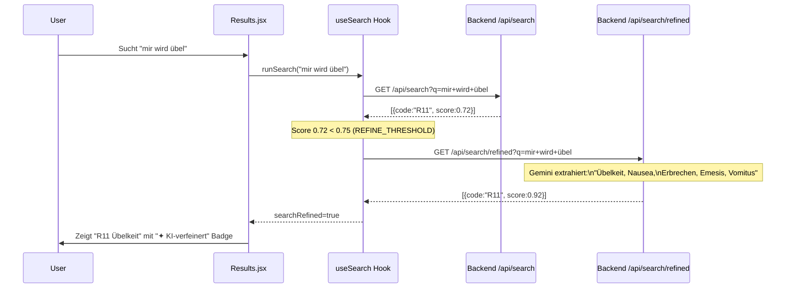

### Technische Umsetzung: Backend

Die Suche im Backend (`SearchService.perform_search()`) ist **dreistufig** (siehe Abschnitt 4.3).

**Meilisearch-Deduplication:** Da Meilisearch sowohl 3-stellige (parent) als auch 4+-stellige (subcode) Einträge zurückgibt, werden:

1. Alle Ergebnisse auf 3-Steller gruppiert
2. Subcodes mit einem **15%-Penalty** auf den Score belegt (`score × 0.85`)
3. Nur der beste Score pro 3-Steller-Gruppe behalten

**Grund:** Ohne Penalty würde z.B. "Diabetes Typ 2" den Code `O24` (Diabetes in der Schwangerschaft, Subcode O24.1) höher ranken als `E11` (Diabetes mellitus Typ 2), weil O24.1 mehr passende Wörter im Titel hat.

---

## 16. Feature: AI-Cache-System

### Motivation des Cache-Systems

Die Gemini API hat **Rate Limits** (Free Tier: 15 RPM) und Latenz (~1-3 Sekunden). Da die drei Info-Blöcke (Erklärung, Facharzt, Behandlung) für denselben ICD-Code immer identisch sind, werden Antworten in der Datenbank gespeichert.

### Ablauf

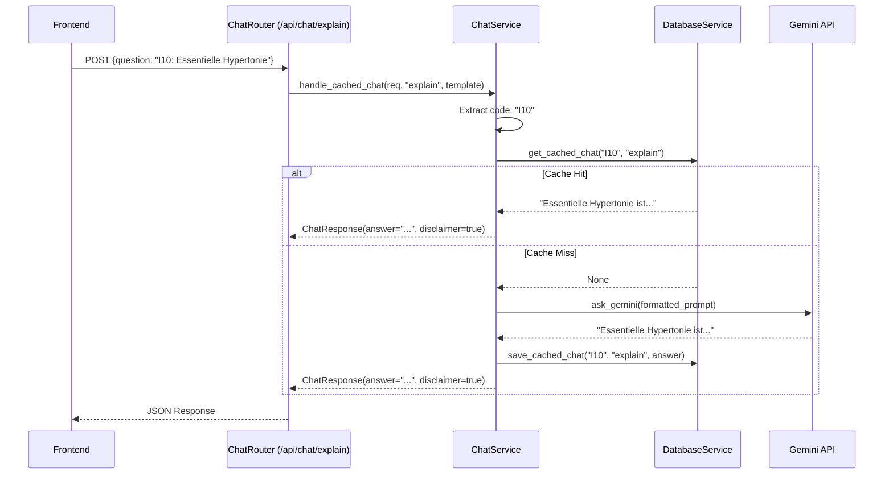

### Cache-Tabelle

```sql
CREATE TABLE icd_ai_cache (
    id SERIAL PRIMARY KEY,
    icd_code VARCHAR(10) NOT NULL REFERENCES icd_class(code),
    prompt_type VARCHAR(20) NOT NULL,  -- 'explain', 'specialist', 'guidance'
    response_text TEXT NOT NULL,
    created_at TIMESTAMP DEFAULT CURRENT_TIMESTAMP,
    UNIQUE (icd_code, prompt_type)      -- Maximal 1 Antwort pro Code+Typ
);
```

### Cache-Seeding

Das Script `seed_cache.py` wärmt den Cache mit den 100 häufigsten Krankheiten vor. Dadurch haben ~300 Einträge (100 Codes × 3 Prompt-Typen) sofort Antworten — ohne API-Wartezeit für den User.

---

## 17. Feature: Sitemap & SEO

### Landing Page: A-Z-Index

Auf der Landing Page (`Home.jsx`) wird beim Laden ein **A-Z-Index** aller gecachten Krankheiten angezeigt:

```text
User öffnet medcode.ch
   → Frontend: GET /api/cached-conditions
   → Backend: SELECT DISTINCT c.code, c.title FROM icd_class c JOIN icd_ai_cache a ...
   → Frontend zeigt Buchstaben-Navigation: [A] [B] [C] [D] ...
   → User klickt "D" → Filtert: "Demenz", "Depression", "Diabetes mellitus Typ 2"
   → User klickt "Depression" → navigiert zu /depressive-episode/F32
```

### Sitemap für Google

Der Endpunkt `GET /sitemap.xml` generiert dynamisch eine XML-Sitemap:

```xml
<?xml version="1.0" encoding="UTF-8"?>
<urlset xmlns="http://www.sitemaps.org/schemas/sitemap/0.9">
    <url>
        <loc>https://medcode.ch/</loc>
        <changefreq>daily</changefreq>
        <priority>1.0</priority>
    </url>
    <url>
        <loc>https://medcode.ch/essentielle-hypertonie/I10</loc>
        <changefreq>weekly</changefreq>
        <priority>0.8</priority>
    </url>
    <!-- ... 100+ weitere URLs -->
</urlset>
```

---

## 18. Feature: Kontextueller Chat

### Motivation des kontextuellen Chats

Nach der Diagnose möchte der User oft Folgefragen stellen wie „Kann das chronisch werden?" oder „Welche Untersuchungen werden gemacht?". Der kontextuelle Chat beantwortet diese **im Kontext** der aktuellen Diagnose.

### Chat-Ablauf

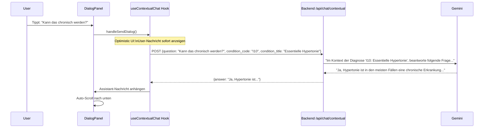

### Unterschied zu den Info-Blöcken

| Aspekt         | Info-Blöcke (explain/specialist/guidance) | Kontextueller Chat                                |
|----------------|-------------------------------------------|---------------------------------------------------|
| Gecacht? | ✅ Ja, in `icd_ai_cache` | ❌ Nein, jede Frage ist individuell |
| Prompt | Fest vordefiniert pro Typ | Dynamisch: User-Frage + Diagnose-Kontext |
| Request-Model | `ChatRequest` (nur question) | `ContextualChatRequest` (question + code + title) |
| Angezeigt als | 3 Karten im Grid | Chat-Bubbles (user/assistant) |
